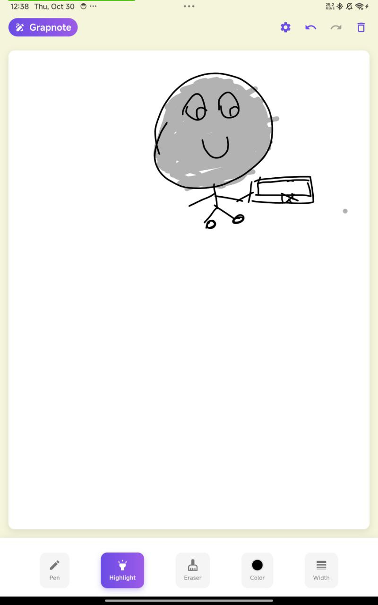

# 🧠 Grapnote



**Grapnote** is a smart **note-taking and drawing app for Android**, built with **Flutter**.  
It lets you write or sketch naturally on any touchscreen — even without an official stylus — using a unique **One-Touch Lock System** that allows true palm rejection and smooth, paper-like writing.


---

## 🧩 About

The **Grapnote** project aims to make digital writing feel as natural as pen and paper.  
It accepts input from **anything the screen detects** — a cheap stylus, charger tip, or even your finger — and filters every other touch automatically.

The result: you can rest your hand freely, focus on your ideas, and enjoy **smooth, realistic handwriting** without expensive accessories.

---

## 📜 Features

- **One-Touch Lock ✋** — detects your writing point and ignores all other contacts.  
- **Natural Drawing ✍️** — fluid ink strokes with no lag.  
- **Palm Rejection 🤚** — rest your hand on the screen comfortably.  
- **Smart Tools 🎨** — pen, brush, eraser, and color picker.  
- **AI Stroke Smoothing 🧠** — keeps handwriting clean and stable.  
- **Offline First 🚀** — works entirely without internet.  
- **Modern UI 💎** — clean Material 3 design with smooth animations.  

---

## ⚙️ Tech Stack

- **Framework:** Flutter (Dart)  
- **Target:** Android  
- **Rendering:** Flutter `CustomPainter` + Skia GPU  
- **Touch System:** Custom One-Touch Filtering  
- **UI:** Material 3 + Adaptive Layouts  
- **Future Cloud Sync:** Firebase / Supabase  

---

## 🛠 Installation

```bash
git clone https://github.com/yourusername/grapnote.git
cd grapnote
flutter pub get
flutter run
